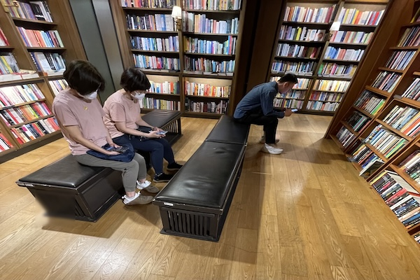

Yesterday I hung out in the bookstore for two hours.

There is a corner in the back of the bookstore where people can sit and read, which I think is a great idea.

Not only does it provide customers with a chance to preview books before buying, it also nurtures a sense of community among readers, something precious in today’s day and age when fewer people read regularly.

However, yesterday's visit to the bookstore made me wonder if that's still the case.

When I entered the reading corner, I saw three people on the benches, two ladies and one man. I was curious about what they were reading, but then I quickly realized everyone was on their phones. None of them had a book in hand or even nearby.

<figure>
  

</figure>
This sight made me quite sad.

To give them the benefit of the doubt, perhaps they were reading on their phones. But during the hour I spent reading there, at least half a dozen people came and went. There was a group of school kids playing games on their phones, an older lady playing Candy Crush, and so on. Only one person actually had a book.

Why don't people read anymore?

<h2>Bookstore vs e-book</h2>

My book to e-book ratio is roughly 20:80. Being home most of the time recovering from my injury, I have more freedom to read physical books I already own since I don't need to carry them around. Physical books are special in the sense that they create a connection to the worlds of the books that e-books simply cannot match.

I appreciate bookstores for their atmosphere, presence, and the comforting sight of colorful books lining the shelves (having to tilt my head to read the spines is my only complaint). Browsing the shelves in a bookstore feels worlds apart from selecting e-books on Amazon's bookshelf.

However, I own an e-reader because, given how many books I read and my limited space, it's simply not practical to buy physical books exclusively. Though I still keep some physical books, I've sold most of them for a low price (list of books I am selling for 10HKD each)

Cost is obviously a big concern for most of us budget-conscious nerds. Physical books typically cost more than e-books. Yes, we have to factor in the cost of the device itself, but depending on how much you read, that expense often balances out quickly. For example, I got my Kindle second-hand for 500HKD, about 65USD.

Given the significant advantages of e-books over physical books, it's understandable that traditional books are becoming less popular. Yet above all, my hope for books, such a precious commodity in our world, is that people never stop reading them, in whatever form they prefer.