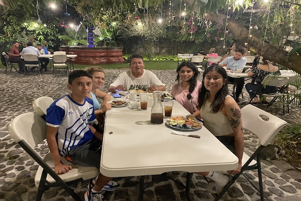
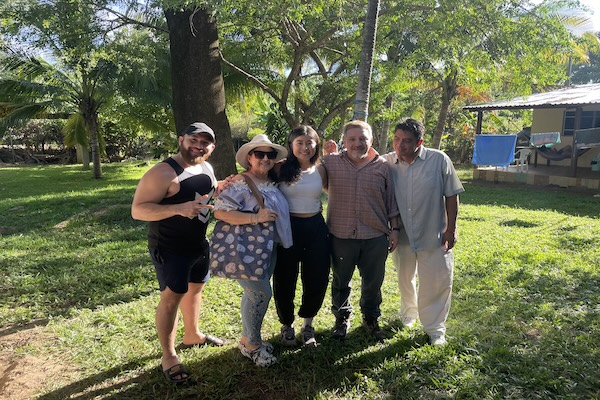
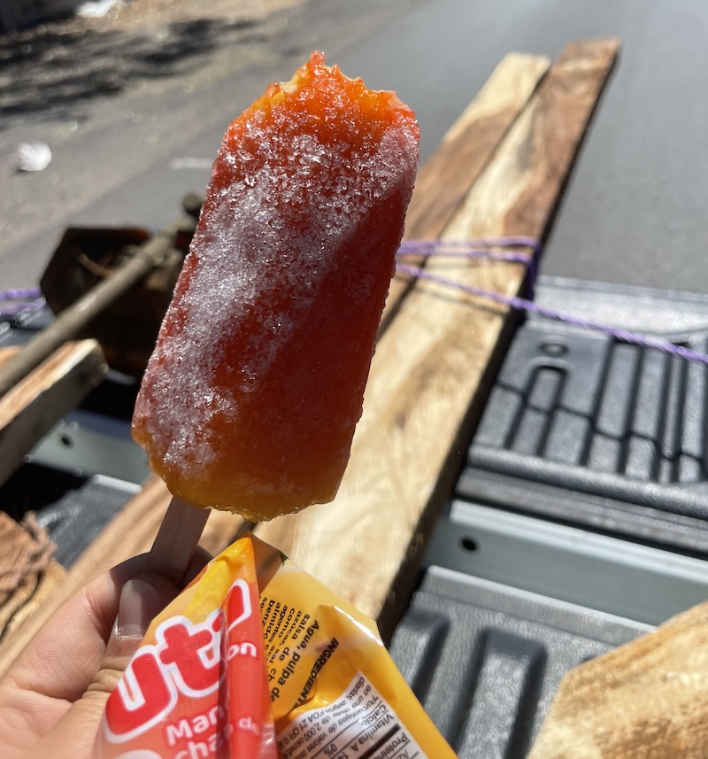

Even when things don’t work out, things work out.

I was on my way back to San Miguel from San Salvador and i was having no luck with hitchhiking. The direct drive was supposed to be 3 hours long, i took 3 different rides but i was still 2 hours away. It was getting dark and I didn’t want to hitch another ride after dark, and there was no buses either, I was terrified. 

I shared my situation to the family who picked me up, who was gonna drive me 15 minutes away. And they offered to host me for the night. We went out for dinner together at a really nice restaurant, and when back to their house and had a lovely time together. Their two kids, Lucero and David and I played football on the road next to their house, and they invited me to their daily prayer.

Lucero and I became fast friends. She is so curious about my culture and also so eager to share hers. I stayed at her room for the night and had the best girl talks. the 11 y.o. David is so intelligent and sharp, he was always the first one to help me finish my sentence when i stutter or forget Spanish words. He taught me so many new words.

<figure>
  

</figure>

The next day i parted with them and continued hitchhiking back to the east. Luis picked me up and invited me to his family beach house where his family is vacationing. His family offered me food, we went to the beach together, soaked in the sun and had nice conversations. There were pelicans catching fish right next to us.

<figure>
  

</figure>
<figure>
  

</figure>

The mishaps and problems has lead to the most magical encounters. Had I not had issues with my visa, I wouldn’t have to make trips to the embassies. Had i not had bad luck with hitchhiking back from the capital where all the embassies are, I wouldn’t have met the lovely people who showed me so much kindness. The experiences I had for the past few days made me feel so much at peace with the seemingly ‘bad things’ that happened in my trip because I know all of it creates conditions for the best encounters and experiences.