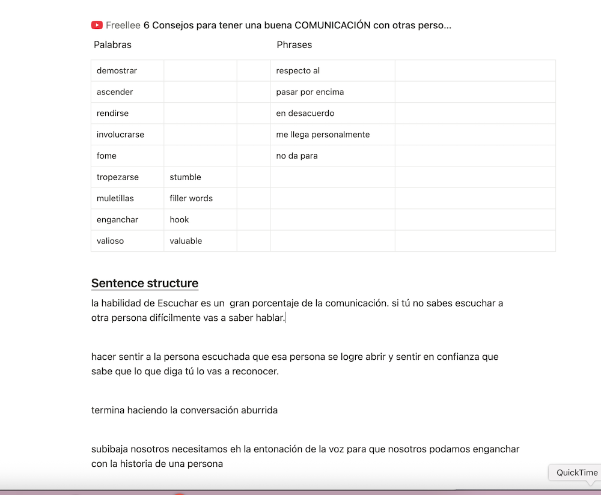

<h2> Comprehensive input</h2>

I only consume content for entertainment in Spanish. Be it Netflix, Youtube, songs etc. Obviously I still read and watch some YouTube in English, but that’s for topics that I would not be able to fully comprehend in Spanish. 
In fact, I set this rule for myself when I was trying to improve my English, and the habit never left me, therefore I almost never consume content in Cantonese. 

<h2> Daily entry</h2>

I do an entry of Spanish content every day on notion. The piece and nature of content varies every day, Ranging from YouTube videos, news articles, podcasts, or even voice notes from friends. The idea is that every day I can dive deep into a particular topic, and all the words and phrases related to it.

<figure>

  

</figure>

Note that I do not include every single words I don’t know into my daily entry. I only choose the ones that I can see myself using. For example, in an article that I was reading about movies, there was the word ‘Estrenar’ which means to premiere in Spanish. Now, I don’t think I have ever even used this word in English, so I see no point of noting this word down in my entry. It goes into the ‘Good to know’  category of my brain. 

<h2> Anki</h2>

One of the most integral tool for my journey to fluency. There are 3 main ways with which I utilize the flashcard system. Almost all of the materials are extracted from my daily entry.

a. nouns

With nouns, I try not to translate. Whenever possible the front of the flashcard would be pictures instead of their English translations.
<figure>

  

</figure>

b. useful phrases

There is a feature on Anki called Cloze, which is basically fill in the blanks. This helps me tremendously with useful expressions. Below is an example.
<figure>

  

</figure>
c. grammar/tenses

I have given up on textbook style grammar drills. Instead, I use contextualized sentences to learn grammar and tenses, which in Spanish can be a handful. 

<h2>reading</h2>

Reading for pleasure is sacred to me. While I diligently make daily entries for most Spanish content, I keep my fiction reading separate. I prefer to enjoy my romance novels before bed without the need to document new words or phrases I encounter.

<h2> practice practice practice</h2>

a. I write in Spanish every day in my journal. At the first few months of my learning journey I would simply describe my day, what I did, concrete things. Though as I advance I started writing about my feelings and deeper thoughts in Spanish, just like I would in English. The idea is to gradually replace English with Spanish  in my journal, and thus train my brain to think in Spanish.

b. I am very fortunate to have many native Spanish speaking friends. I call them almost every day to chat, which obviously helps a lot with fluency.

I also have an online Spanish teacher, with whom I discuss the topics from my daily entry. That facilitates the conversion of newly acquired words from ‘ah I’ve seen this word somewhere’ to being able to actively use it in my speech. I obviously don’t do this with friends because…well, who hits up their friends and say, ‘Hey wassup? Let’s talk about genetically modified food today!’

c. On days when I don't have Spanish conversations with friends or my teacher, I make a <a  class="link" href="https://youtu.be/p1ngKadnOg4">10-minute recording of myself speaking Spanish.</a> I then review the recording to identify moments where I hesitate or struggle to find words, and add the correct words to my daily entry. Recording yourself, although at first might feel unnatural, is the single most effective way to find out the gaps of your knowledge. Remember, no one has to see your videos if you don’t want them to be seen!

<h2>resources I use</h2>

It’s impossible to list everything, I am a frequent consumer of:

a. YouTube:

<a class="link" href="https://www.youtube.com/@spanishafterhours" >Spanish After Hours</a>- Love her slow Spanish series, suitable for beginners

<a class="link" href="https://www.youtube.com/@HowtoSpanishOfficial">How to Spanish Podcast</a>- Very informative and covers interesting topics

<a class="link" href="https://www.youtube.com/@atherion" >Atherion</a>- His video style is so poetic and soothing, covers topics that are right up my alley

<a class="link" href="https://www.youtube.com/@ElGonzok" >GONZOK</a>- Funny challenges. 

<a class="link" href=" https://www.youtube.com/results?search_query=casi+creativo" > CasiCreativo</a>- Animations. 

b. Music:

 Latino music is amazing - enough said!

¡Oigan, mis amigos de Colombia…según yo, ustedes tienen las mejores canciones:) ¡Que no se lo digan a los demás!

Kapo

J Balvin

Sebastián Yatra

Manuel Turízo

Valentino Merlo

Grupo Frontera

Rels B

Los Sufridos

Beelé

Paulo Londra

The La Planta

Elena Rose

Manuel Carrasco

c. Textbook

A good structured way to get used to grammar. I wouldn’t rely on it to practice though.

<a class="link" href="https://www.goodreads.com/book/show/32282810-complete-spanish-step-by-step" > Complete Spanish Step-by-step</a>