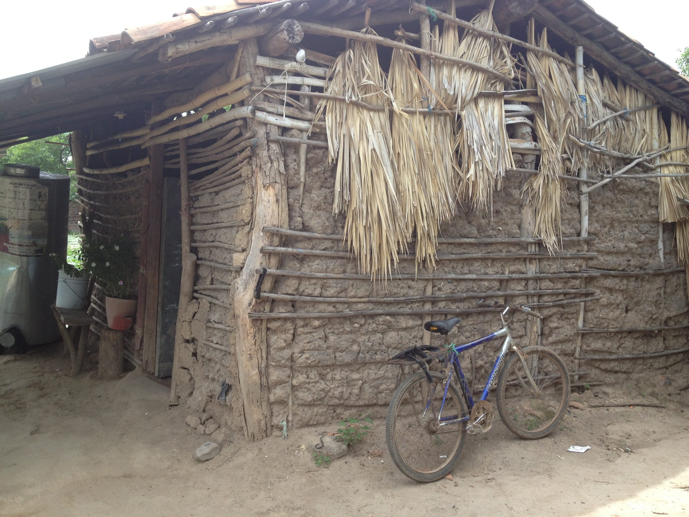
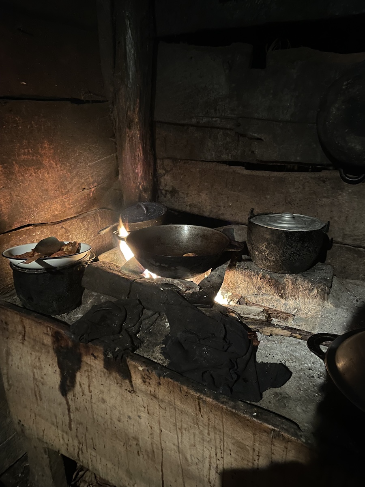
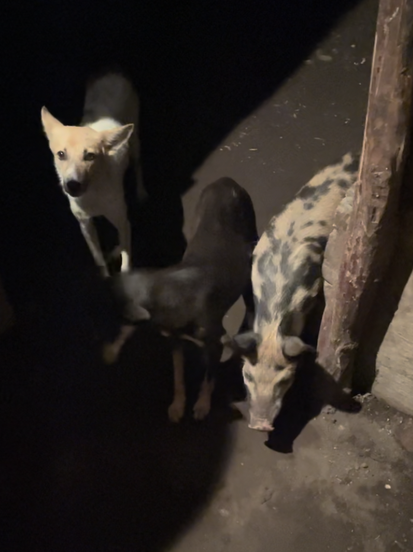

I am invited by my local friend Carlos and his lovely family to spend new year's eve with them in their house.

To my surprise, getting there involves driving on rocky unpaved mud road for half an hour, dragging our moto through a flooded path, walking in the jungle for 20 more minutes and climbing through 2 barbed wires.

Worst part of it all? All of which is done in utter darkness.

With each clumsy step through the dense jungle in the chilly air, my worry soars. The sight of Carlos' machete certainly does not help ease my nerves.

<figure>
  
  <figcaption>The way out in the morning</figcaption>

</figure>

<figure>
  
  <figcaption>Not the actual house but this is what it looks like</figcaption>

</figure>
With the anxiety that has piled up on the way here, I take a deep breath, fix a smile on my face, think to myself, "Here goes nothing." And enter.

Carlos' family immediately welcomes me in their front yard. I meet Carlos' father and nine siblings. We exchange brief conversations, all my limited Spanish can manage at the time. With each question I can't understand and answer I struggle to give, my anxiety mounts. "This is going to be a long night," I think to myself. Despite their immense hospitality and kindness, I can't shake the feeling that I've made the wrong choice, that I should have stayed at the hostel to celebrate New Year's Eve with other travelers.

Feeling tired and dirty from the day, I ask to shower. They show me the way to the bedroom. At first I didn’t understand, but then I see the bucket of water on the bedroom floor, my heart drops. They don’t have a bathroom, nor do they have doors in their house. I have to shower on the bathroom floor in the dark so that I am not seen naked. As grateful as I am for them to let my stay and spend new year’s eve with them, the unfamiliarity of it all makes me feel so on edge.

After what feels like the briefest shower I have taken in my life, I went back out to the front yard. Watching Carlos and his family speak in rapid-fire Spanish, huge grins on their faces, laughing at everything and nothing at all, I feel more isolated than ever. The warmth of their family gathering hangs in the air while a knot of homesickness tightens in my throat. Due to the time difference, I had even forgotten to wish my own family a happy new year.

To get myself some fresh air, I go help out in the kitchen. When I first see it, I think I've walked onto a movie set (thankfully not a horror one). I have never seen anything like it in real life.

The aroma of fresh gallo pinto fills the air, attracting stray dogs into the kitchen. Among the group, I notice an unusual presence. It is a little pig! I am convinced she thinks she is just another dog.

<figure>
  

</figure>
<figure>
  

</figure>

Spending a while in the kitchen helped calm my nerves. The sighting of a pig even makes me laugh a bit. I walk back out to the yard, telling myself, “You got this. Just try to converse as much as you can.”

As midnight approaches, we form a circle with plastic chairs around the front of the shed. Carlos' dad retrieves sparklers from the closet and hands one to each of us. I watch as starlight dances before me. Fleeting, yet leaving an impression that remains to this day.

Carlos' dad sits next to me, places his weathered hand on mine, and says, "No sé si me entiendes, pero cuando vengas de nuevo, mi casa siempre es tu casa." My heart swells with emotion. Though a thousand words fill my mind, all I can manage is a simple "Gracias".

"Cinco, Cuatro, Tres, Dos, Uno, Feliz año nuevo!" we all shout in unison, though my voice stands out with my failed attempt to count backwards in Spanish. All of them burst into laughter, I too laugh out of embarrassment.

The delicate sparks seem to burn away all barriers between us. We light sparkler after sparkler, holding them up in the center of our circle. Though we have different faces and speak different languages, we gaze at the magical display with the same childlike fascination.

I am on the other side of the world, oceans away from my family, on a volcanic island in a jungle shed with a family I barely know. Despite speaking a language I am not familiar with and having no cell signal for translation, I feel an odd sense of familiarity and warmth, as if I have discovered family I never knew existed. All the anxiety that has built up during the journey and from being surrounded by foreign faces and languages simply melts away.

The next day after breakfast, I say goodbye to them, feeling like something in me has changed. A gap in my understanding of the world has been filled. As I step out of the jungle on the first day of a new year, I feel like a different person. Though I will go on to have many similar encounters during my trip, none will leave quite the same profound impact on me.
