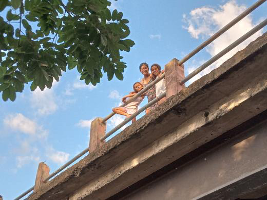
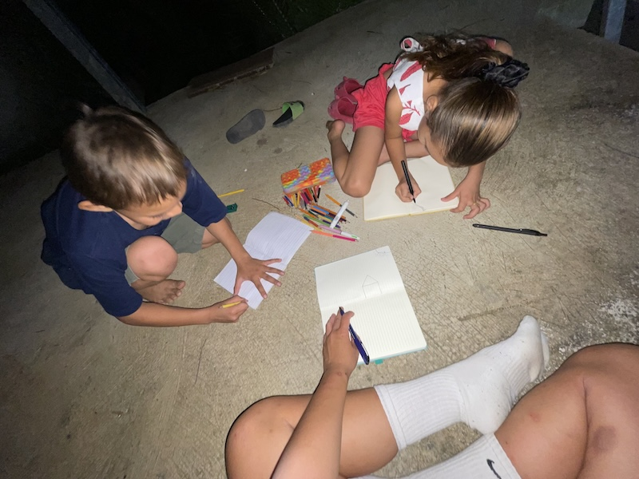
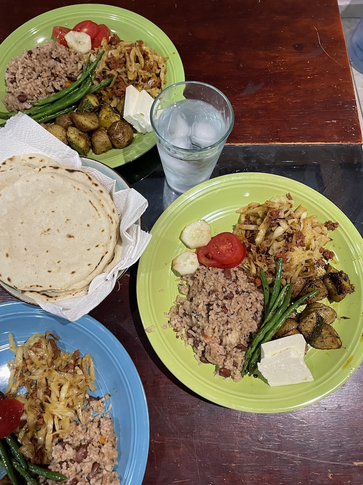

<h2>10 days in El Sauce was spent:</h2>

Exploring with the kids, trekking through rivers, picking mangos, playing football and jumping off bridges

This is the first time I’ve spent so much time hanging out with a bunch of kids. At first it was a challenge, especially when I didn’t understand some of the things they say. But that’s where it gets interesting. Instead of pulling out the translators, they would try to explain it to me in different words in Spanish. I was so amazed by their ability to do that, considering in my experience, some adults don’t even know how to do that.

They are extremely smart and fearless. They led me up the stream of the river looking for hot springs, asked me to jump off bridges with them, got me mangos from the tree… hanging out with them made my heart so full. Their energy is so contagious and they brought so much vibrancy to my time in El Sauce. I still remember on my last few days, they were flipping bottles and saying ‘if it stands, Rachel stays for 4 more weeks’ and believe it or not, my eyes were tearing up.

<figure>
  

</figure>
<figure>
  

</figure>

<h2>Cooking meals for the gentlemen working on the house</h2>

It was an honor to cook for them. I got the chance to make Frijoles, and also prepared gallo pinto, a dish I learned from my friends in Nicaragua. It was such a rewarding experience.
<figure>
  

</figure>
<h2>being bullied by majes (but they love me, i think)</h2>

I definitely stand out in most, if not all, places I visit in Central America. It used to make me feel uncomfortable, and I’d get tired of the stares and name-calling, even though I knew it was mostly out of curiosity. But here in El Sauce, I’ve felt more welcomed than anywhere else. Over the past 10 days, I’ve experienced almost zero social anxiety—whether i am accompanying the guys drinking beer, or being in family outings with the kids, I never felt excluded or like i am intruding.

They were all so eager to learn about my culture, language, and even though they make me say bad words in spanish and make fun of me, or tell racist jokes, they became my brothers and sisters in no time.