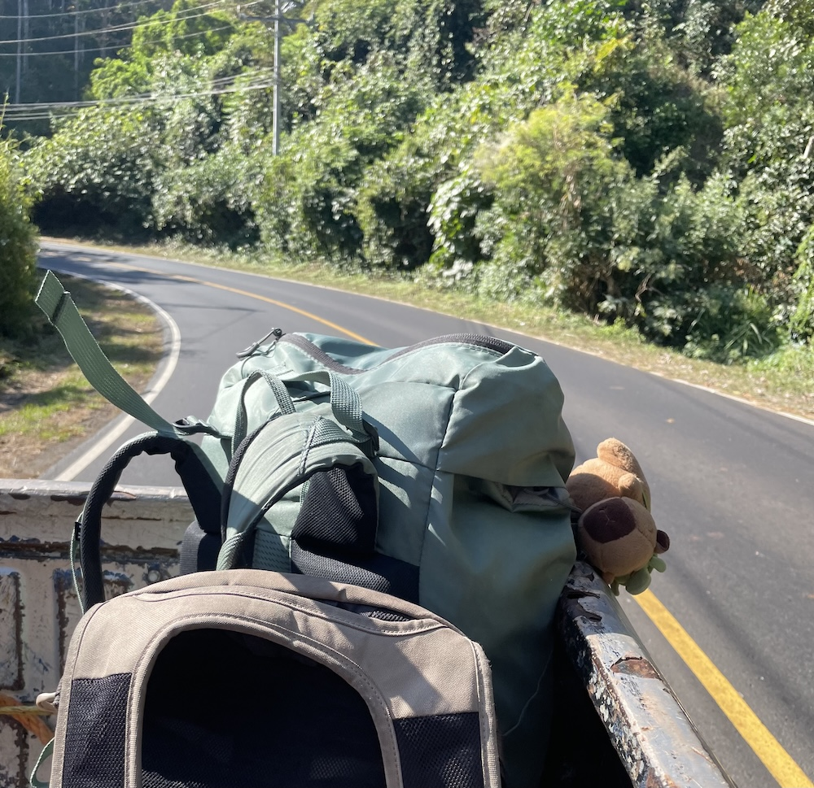

A very close friend of mine, who’s also a backpacker, have some stuff stored in my home in Hong Kong.

He loves to paint while traveling. He captures a variety of subjects. Landscapes, shops, street views,people. He is a genius for capturing the essence of places.

I have one of his sketchbooks on the display corner of my bedroom, turned to a new page every once in a while.
<figure>
  
</figure>

Every time I lay eyes on it, It feels as if he is taking me along with him in his adventures.
Currently on display is this painting featuring a hidden river in Japan surrounded by lush green. Across the serene water lays a bridge. Near the shore sits a capybara wearing a green turtle backpack, appreciating the scenery.

Before my Central America trip, he gave me a capybara plushy that stayed attached to my backpack for months, until I unfortunately lost it after my accident.
<figure>
  
</figure>

The capybara in his painting not only pulled some invisible strings of memories and connections with him in my heart, but also makes me wonder if my lost plushy is safely tucked away in a beautiful corner somewhere in El Salvador, gazing at the scenery with those same captivated eyes.
