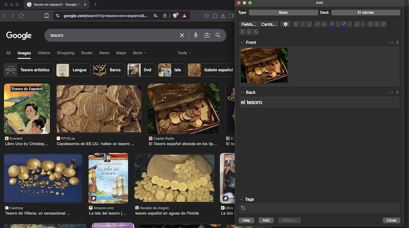
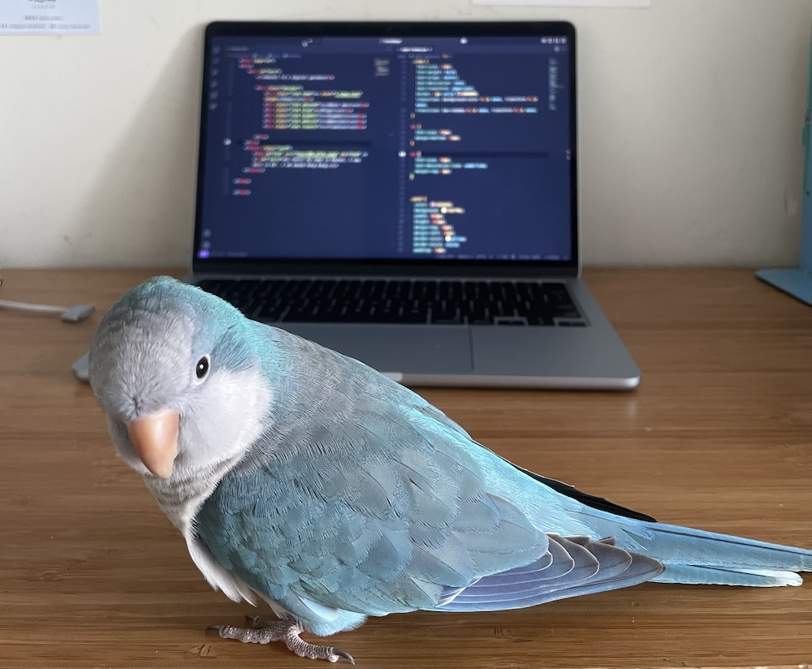

Anoche cuando estaba estudiando español, tuve un pequeño pensamiento.

Aprendí la palabra "tesoro". Cada vez que aprendo un nuevo sustantivo, busco una imagen y la pongo en mi flashcard.

Esa vez, cuando vi las imágenes que se presentaban, todas eran monedas, gemas, todo lo que tiene que ver con plata, algo físico.
<figure>
  
</figure>

Y para mí, mis tesoros son más que monedas. Entonces, acá te presento mis queridos tesoros.

<h2>Mi pajarito</h2>

Siempre ha sido un buen compañero de trabajo.

<figure>
  
</figure>

<h2>La pared en mi cuarto</h2>

Esa pared está en frente de mi escritorio. Allí pongo todas mis ideas, inspiraciones, fotos, postales y todo eso.

<h2>El paisaje de la ventana de mi cuarto</h2>

Gracias mamá por proveernos un entorno tan cómodo y bonito para vivir.

<h2>Fotos impresas de cuando era chiquita</h2>

Extraño mucho la época cuando no había teléfonos con cámaras buenas, cuando todo el mundo andaba con una cámara real para capturar todos los momentos preciosos. Además, me gusta mucho ver las fotos impresas. Me parecen más reales que las que quedan en las pantallas y me traen muchos recuerdos hermosos.

<h2>Mis diarios</h2>

Me pongo muy contenta cada vez que leo mis diarios antiguos. Me sirven de recuerdo de mi crecimiento.

<h2>Mis libros</h2>

Los libros son una de las mejores cosas que tenemos en el mundo. Para mí son cajas llenas de conocimiento, y leer un libro es como dar un paseo por el mundo de los pensamientos de los escritores.

<h2>Esta página (la que estás leyendo ahora mismo)</h2>

Este es el proyecto más grande que he tenido en mi vida. Es algo que jamás creí que iba a estar haciendo. Por este proyecto he aprendido un montón de cosas. Además, es el mejor lugar donde puedo expresarme sin las restricciones que nos dan las redes sociales. La diseño como quiero, escribo como quiero, puedo hacer prácticamente cualquier cosa si me da la gana (cosas legales, por supuesto). Estoy muy, pero muy orgullosa de haberlo hecho.

<h2>Mis tatuajes</h2>

Me encantan mis tatuajes porque todos ellos me representan. O sea, no físicamente sino como persona, mi personalidad, mi estilo.

<h2>Mi familia y amigos</h2>

Pues ninguna cantidad de palabras es suficiente para expresar lo importantes que son para mí. Los amo mucho.

<h2>Mis ganas de conocer y aprender</h2>

Ok, la verdad es que esto me da un poquito de cringe pero igual, estoy muy agradecida conmigo misma porque sé que nunca dejaré de conocer el mundo de formas distintas, de aprender lo más que se pueda.

De hecho, ahora mismo estoy aprendiendo a caminar nuevamente. Tuve un accidente hace 2 meses y me emociona mucho poder caminar de nuevo.